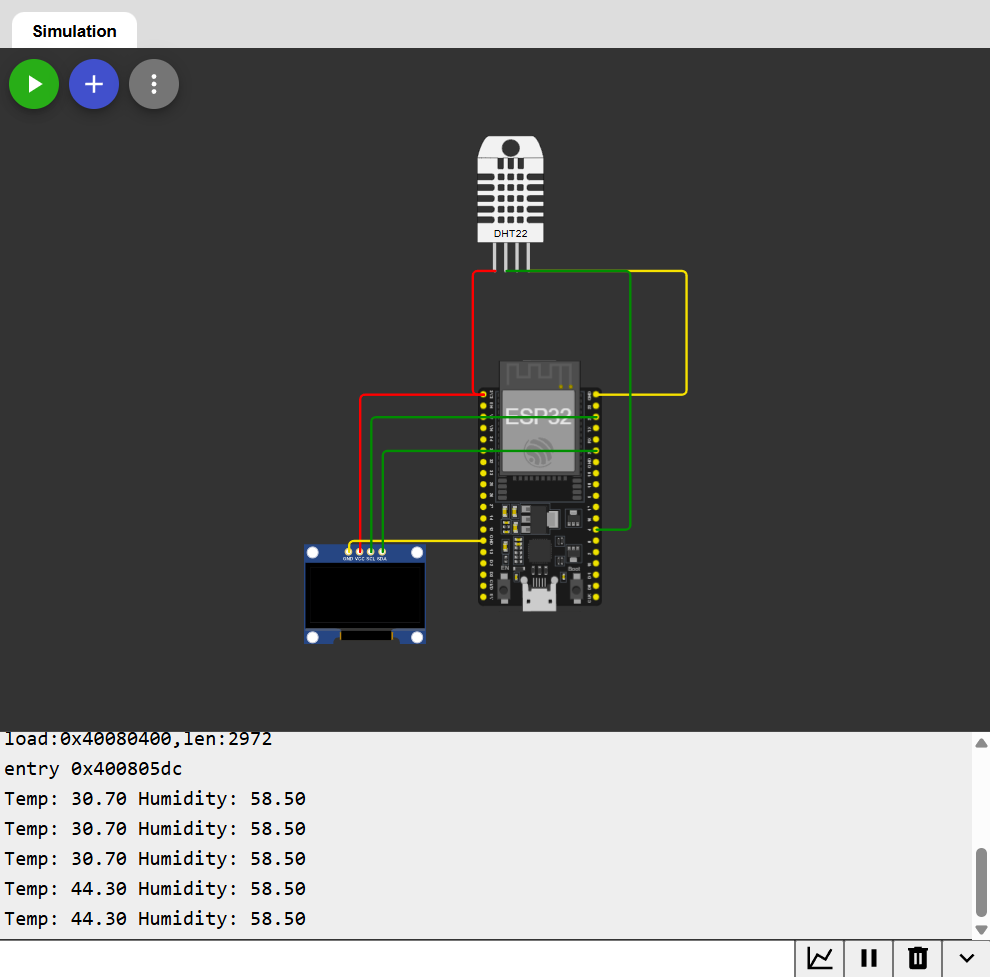

# DHT22 + OLED Temperature/Humidity Display

Reads live temperature and humidity from a DHT22 sensor and displays it on an SSD1306 OLED screen.



## How it works
1. DHT22 is read via a single-wire timing protocol using the `DHT` library
2. Readings are checked for `NaN` (failed reads) before use — a real-world reliability pattern
3. Values are rendered to the OLED via I2C using Adafruit's GFX + SSD1306 libraries

## Wiring
| Component | ESP32 Pin |
|---|---|
| DHT22 VCC | 3.3V |
| DHT22 DATA | GPIO 4 |
| DHT22 GND | GND |
| OLED VCC | 3.3V |
| OLED GND | GND |
| OLED SDA | GPIO 21 |
| OLED SCL | GPIO 22 |

## Libraries
```
Adafruit GFX Library
Adafruit SSD1306
DHT sensor library
Adafruit Unified Sensor
```

## Code
See [`sketch.ino`](./sketch.ino)

## Concepts learned
- I2C communication (SDA/SCL, device addresses)
- Reading sensor libraries and handling failed/invalid reads
- Rendering to a display buffer (`display.display()`)
