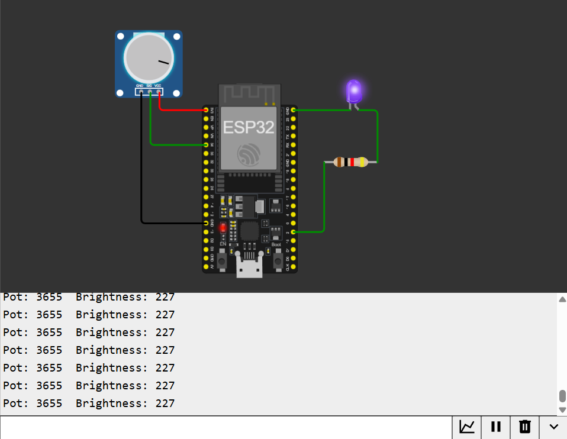

# Potentiometer-Controlled LED Brightness

Turning a potentiometer knob smoothly dims/brightens an LED in real time, using ESP32's ADC to read the pot and its LEDC PWM peripheral to control brightness.

## How it works
1. Potentiometer wiper connects to GPIO 34, read via `analogRead()` (0–4095, 12-bit ADC)
2. The raw ADC value is rescaled to the PWM range (0–255) using `map()`
3. `ledcWrite()` drives the LED at the resulting brightness via PWM

## Wiring
| Component | ESP32 Pin |
|---|---|
| Potentiometer VCC | 3.3V |
| Potentiometer GND | GND |
| Potentiometer Wiper | GPIO 34 |
| LED Anode (via resistor) | GPIO 2 |
| LED Cathode | GND |

## Code
See [`sketch.ino`](./sketch.ino)

## Concepts learned
- ADC (analog-to-digital conversion) and 12-bit resolution
- PWM as a way to simulate variable output on a digital-only pin
- Mapping one numeric range to another (`map()`)
