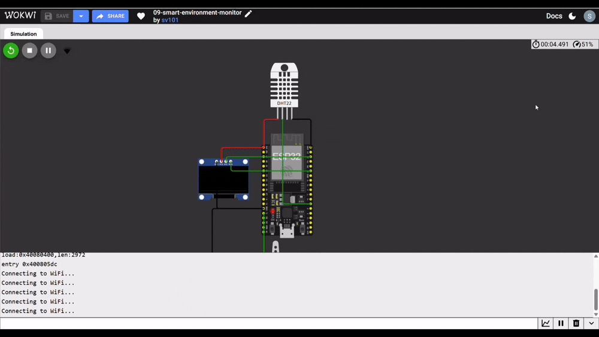

# Smart Environment Monitor

Integrates a temperature/humidity sensor, OLED display, Wi-Fi web server, and a servo-actuated vent into one system — combining sensing, display, networking, and actuation into a single working device.



## How it works
1. DHT22 continuously reads temperature and humidity
2. Data is displayed live on the OLED
3. A web server serves the same data plus vent status to any connected browser
4. An automatic control loop opens the vent (servo) if temperature crosses a threshold
5. A manual override lets the web interface force the vent open/closed, bypassing automatic control until reset

## Wiring
| Component | ESP32 Pin |
|---|---|
| DHT22 DATA | GPIO 4 |
| OLED SDA / SCL | GPIO 21 / GPIO 22 |
| Servo Signal | GPIO 13 |

(Power/GND connections as in individual component projects above)

## Libraries
```
Adafruit GFX Library
Adafruit SSD1306
DHT sensor library
Adafruit Unified Sensor
ESP32Servo
```

## Code
See [`sketch.ino`](./sketch.ino)

## Concepts learned
- Combining multiple peripherals (I2C + single-wire + PWM + Wi-Fi) in one program
- Basic state management: automatic vs. manual override logic
- Structuring a `loop()` that services a web server without blocking sensor reads
