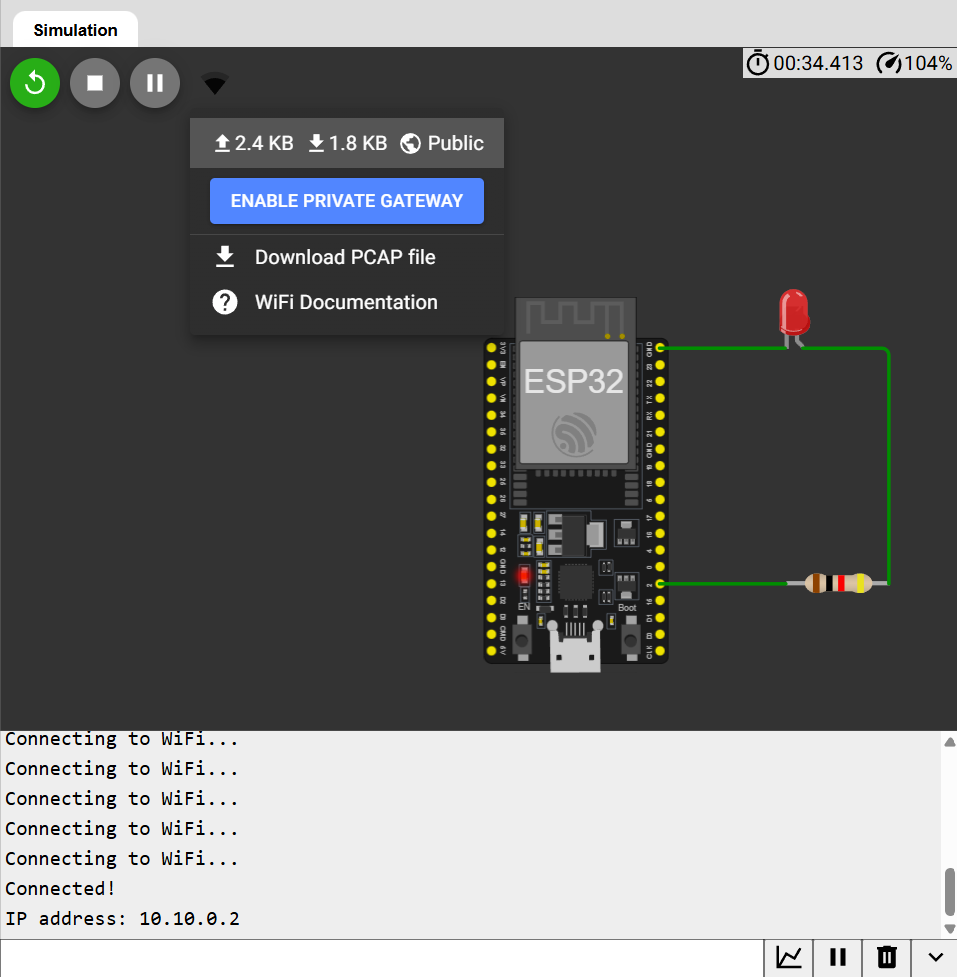

# Wi-Fi LED Web Server

ESP32 hosts a small web server with ON/OFF buttons to control an LED remotely — a browser-based interface built directly on the microcontroller.

## How it works
1. ESP32 connects to Wi-Fi (`WiFi.begin`)
2. A `WebServer` instance listens on port 80 and registers routes (`/`, `/on`, `/off`)
3. Each route handler sends an HTTP response and updates the LED's digital output
4. Button clicks trigger a redirect back to `/` so the page refreshes cleanly

## Wiring
| Component | ESP32 Pin |
|---|---|
| LED Anode (via resistor) | GPIO 2 |
| LED Cathode | GND |

## Code
See [`sketch.ino`](./sketch.ino)

## Concepts learned
- Wi-Fi connection handling on ESP32
- HTTP server basics: routes, status codes, redirects (conceptually similar to Express.js)
- Bridging embedded hardware with a web-based control interface

## Note
Tested via Wokwi's simulated network — full browser access requires Wokwi Pro's private gateway or real hardware on a home Wi-Fi network, since the free simulator's IP isn't reachable from an external browser.
